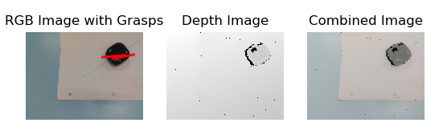

.. _grasping_model_v1:

Grasping Model v1
=====================

Overview
--------

The first version of our grasping model consists of ___________. It uses an Intel Realsense D435 depth camera to obtain a depth image
of the environment and executes a ______ to obtain appropriate grasp parameters. 
Next, the grasp parameters are fed into a ROS service pipeline to subsequently be fed into MoveIt's motion planning algorithm.

.. note::
   This model was tested using the Interbotix ReactorX-150 arm and the Intel RealSense Depth Camera D435. Instructions on how to set up can be found in the :doc:`rx150-setup` section.

Contents
--------

.. toctree::
   :maxdepth: 2

   installation
   getting_started
   nodes/predict_result_subscriber
   api
   contributing
   changelog
   license

Grasp Parameters
----------------

   - *Center*
   - *Angle*
   - *Length*
   - *Width*

GraspService.srv
----------------

float32 y_offset
float32 z_offset
float32 distance
float32 grasp_length
---
`moveit_msgs/Grasp <http://docs.ros.org/en/noetic/api/moveit_msgs/html/msg/Grasp.html>`_ grasp
bool success

.. note::
   With respect to the depth camera, positive *x* is defined as into the page, positive *y* is defined as up, and positive *z* is defined as right.

Integration with ROS
--------------------

The subscriber node ``predict_result_subscriber`` is initialized to listen for messages through the 
When data is received, ``grasp_client()`` is executed. First, a ``GraspServiceRequest`` message object is created and the program fills in the relevant message fields.

.. code-block:: python
   req = GraspServiceRequest()
   req.y_unitVector = math.sin(result.data[0])
   req.unitVectoz_r = math.cos(result.data[0])
   magnitude = result.data[1]
   req.distance = result.data[2]
   req.y_offset = req.y_unitVector * magnitude
   req.z_offset = req.z_unitVector * magnitude
   req.grasp_length = result.data[4]

As shown in the code above, unit vectors in the *y* and *z* directions are calculated to determine the direction of the arm's approach to the object.
The ``magnitude`` is the absolute value of the combined *y* and *z* distances from the center of the image to the object in 2D space.
The ``req.distance`` object field is the distance from the camera to the centre of the object in centimetres.
The ``req.y_offset`` and ``req.z_offset`` object fields are the respective *y* and *z* distances in centimetres from the centre of the depth image to the centre of the object.
The ``req.grasp_length`` object field is the width between the end effector fingers when picking the object.

.. note::
   For the ReactorX-150 arm, the end effector finger positions are defined with respect to the middle of the two. Therefore, the position value for each finger will be half of ``req.grasp_length``.

A box is added to MoveIt's planning scene to simulate a bounding box for the grasping object. The dimensions of the box are equal to half the grasping length,
and the xyz coordinates of the box match the grasping coordinates.

.. code-block:: python
   ps_box = PoseStamped()
   ps_box.header.frame_id = "camera_link"
   ps_box.pose.orientation.w = 1.0
   ps_box.pose.position.x = req.distance
   ps_box.pose.position.y = req.y_offset
   ps_box.pose.position.z = req.z_offset
   scene.add_box('boundingBox', ps_box, size=[req.grasp_length/2,req.grasp_length/2,req.grasp_length/2])

Next, ``grasp_service`` is called under a `ServiceProxy` and the ``GraspServiceRequest`` object is fed to ________.
A ``Grasp`` object is then returned from the service and inputted into ``arm_mvgroup.pick()`` for motion planning and execution.

.. code-block:: python
   arm_mvgroup.pick(object_name='testBox', grasp=grasps)

.. note::
   The function will not execute without an *object_name* parameter, and the *grasp* parameter in the move_group ``pick()`` function above needs to be an array of ``Grasp`` objects.

blah blah blah

